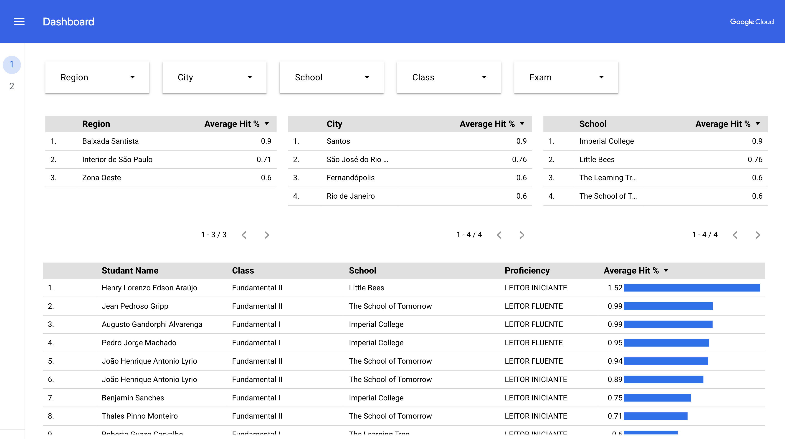

# Artificial Intelligence Reading Assessor (AIRA)

AIRA is an open-source **demo experiment** created by [Google Cloud](https://cloud.google.com) Education Engineers that was put together to help educators on identifying reading gaps reading and interpreting a text.

AIRA was designed to be as simple and flexible as possible so that it could be easily integrated into whatever pre-existing, either pedagogical or administrative student information system might be in place.

After applying an online test, thanks to [Google Cloud's AI platform](https://cloud.google.com/use-cases/generative-ai), AIRA automatically classifies a given reader as ("Pré-reader", "Reader" and "Advanced") and scores individual reading performance into an analytical dashboard, allowing educators and institution's internal crew to easily understand the evolution of students individually, per class, per region, per school, so on so forth.

> Please do not use any personal or sensitive data with this demo. This demo should not be used by children under 13 or to process data from children under 13.

## Documentation

* [Concepts and architecture](./docs/concepts-architecture.md)
* [Pre-requisites](./docs/pre-requisites.md)
* [Building the cloud infrastructure](./docs/building-cloud-infrastructure.md)
* [Building the frontend](./docs/building-frontend.md)
* [Building the backend](./docs/building-backend.md)
* [Publishing AIRA into Google Cloud](./docs/publishing-aira.md)