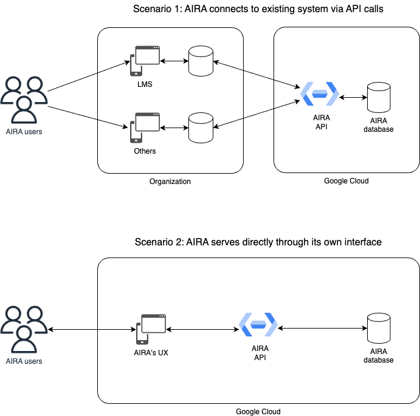
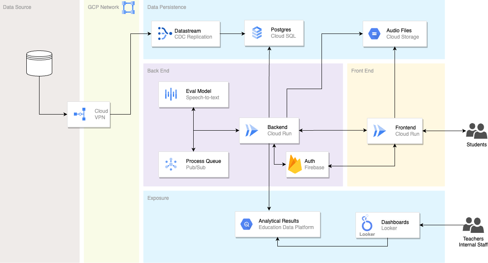

# Concepts and architecture

AIRA is an **experimental demo** developed by Google Cloud engineers as part of a bigger effort to apply responsible AI into Education.

It uses [Google Cloud's Speech to Text API](https://cloud.google.com/speech-to-text?hl=en) to automatically convert people's reading sentences (an audio file) into text and from there, using another layer of intelligence, scores and classify phonetical reading performance.

## Usage scenarios

By default, the experiment app brings its own graphical interface considering a scenario of utilization where a complete deployment can be held, but it doesn't mean that there is no other way to use it.

The whole process is made through API calls in the back, which means that the user interface is completely decoupled from the backend and so it could be easily incoporated to whatever pre-existing system necessary.

The Figure 1 below depicts these two scenarios.

Figure 1. Usage scenarios for AIRA

## Architecture

AIRA's architecture in Google Cloud is very lean and mostly directed to events as you can see through Figure 2.

Figure 2. AIRA's architecture

This the overall flow for the solution:

* First, administrative data is imported to AIRA's database ([Cloud SQL for Postgres](https://cloud.google.com/sql/docs/postgres#:~:text=Cloud%20SQL%20for%20PostgreSQL%20is,databases%20on%20Google%20Cloud%20Platform.)), either via export files or some data pipeline that might be in place or which it is about to be created. This data is basically schools, classes, city, state, and enrollment.
* Every new audio (containing a reading sentence) is automatically uploaded to GCS bucket by the backend API.
* Backend then automatically triggers another event: put in the new audio to be processed in the queue.
* Every new message in the queue gets mapped out by a built-in listener, which triggers Speech to Text API to process the given audio.
* Processing result (Speech to Text output) is then saved in BigQuery (preferable through [EDP](https://github.com/googlecloudplatform/education-data-platform) due data governance layer) while operational data is saved in Postgres.
* Backend API and Frontend runs on top of [Cloud Run](https://cloud.google.com/run/).
* Dashboards can be built in whatever tool available. Google Cloud recomemends [Looker](https://cloud.google.com/looker?hl=en) for that purpose.
* Firebase is used for API authorization process.