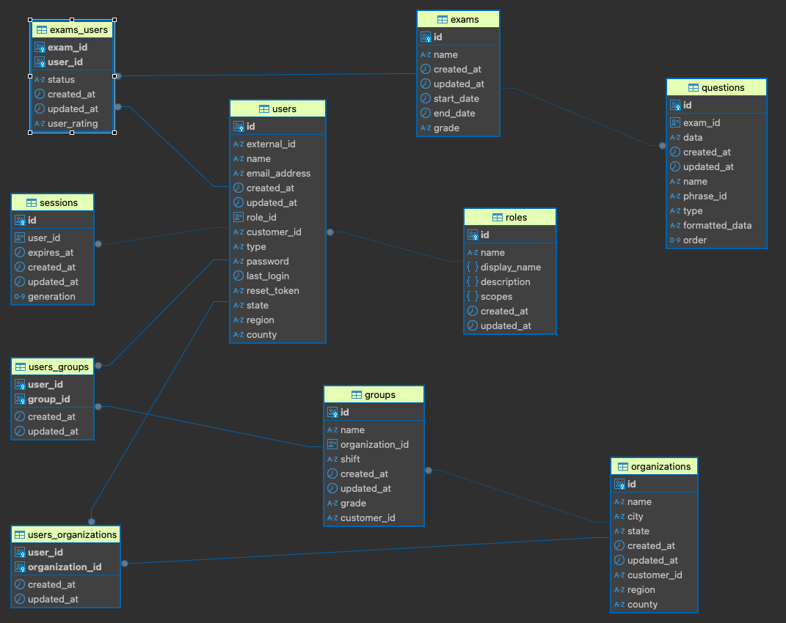
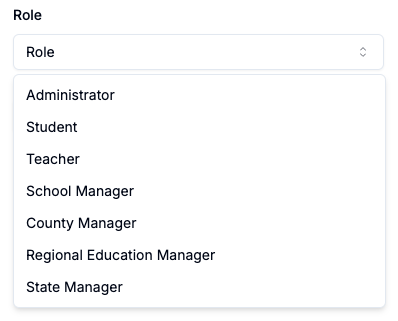
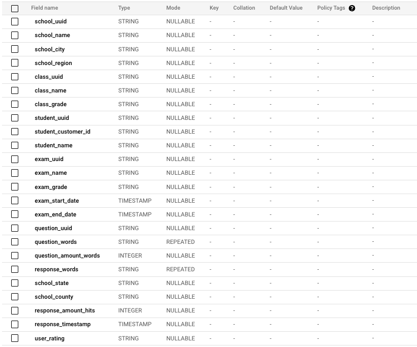

# Data structure

AIRA has a very simple and lightweight data structure to support primary information for the solution. It is basically broken down in two different approaches to support different data needs: transactional and analytical.

This is because AIRA does require an efficient approach for transactional data (especially fast, reliable, and ACID-compliant features) for CRUD operations within the platform while, at the other hand, it combines this relational data being produced with unstructured data coming from the reading audios being sent and processed by students in parallel. 

AIRA then processes everything to generate the reading proficiency analysis. That's the reason by which we need both transactional and analytical tools, as listed below.

## AIRA's relational (and transactional) database

We use [Postgres on top of Cloud SQL for Postgres](https://cloud.google.com/sql/docs/postgres) for transactional data. It manages AIRA's transactional data across tables, ensuring data integrity, consistency, and durability during operations. This facilitates fast, reliable, and secure data manipulation, enhancing the accuracy and trustworthiness of stored information while providing scalability needed for the application.

AIRA's Diagram Entity-Relationship (DER) for core tables can be seen below.

The most important tables you should be aware of and which the system is comprised by are listed below.

* **users**: Stores data from users in the platform. As you can see, it interacts with most tables within the system. As you can see below, users can assume multiple roles within the application.

* **roles**: Stores data from user's roles. A user can assume any role from student all the way up to Regional Schools Manager, as depicted by the image below. 

* **organizations**: Stores data from organizations. It can be a single schools or a state, depending on how you're planning to use AIRA for.

* **groups**: Stores classroom or whatever group of users you might think of. It is the unity used by the system to group users together.

* **sessions**: Controls data for exams/tests sessions. 

* **exams**: Stores exams/online tests' data. It ties directly with questions as you might imagine.

* **questions**: Stores data related to questions. Questions are a key component of AIRA as it holds the mechanisms to collect reading data from users.

> Tables `exams_users`, `users_groups` and `users_organizations` are only used for normalization purposes where "N-to-N" relationships are needed.

A full view of AIRA's tables and views can be seen through **[this link](img/er-aira-full.png)**.

## AIRA's analytical database

[Big Query](https://cloud.google.com/bigquery/docs) contributes to AIRA's analytical efficiency through its scalability, cost-effectiveness, flexibility, and integration. Its discentralized cloud-based architecture enables fast processing of large amounts of unstructured audio data. Its cost-effective pricing model allows AIRA to focus on its core mission. Its flexible data model and SQL-like query language enable diverse data analysis. Integration with Postgres enables combining structured and unstructured data for comprehensive analysis. Big Query enhances AIRA's ability to analyze students' reading proficiency and tailor interventions.

Within Big Query, AIRA does create one single table view (called `students_lia`), where it concentrates all the data it needs to perform the clusterization of reading results coming out of the tests being performed by students. Its structure can be seen through the picture below.

