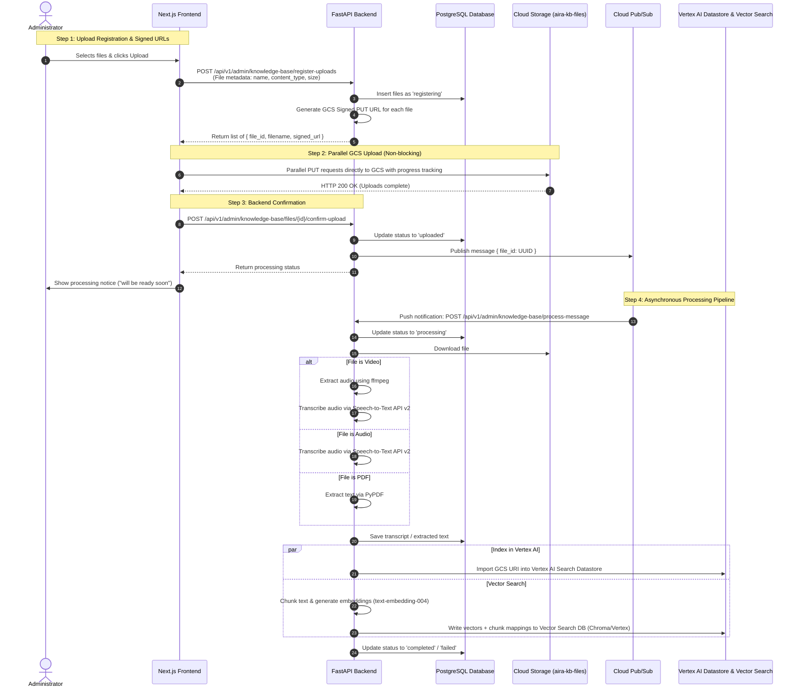

# Pedagogical Knowledge Base Feature - Development Plan & Architecture Spec

This document details the development plan and technical specifications for the new **Pedagogical Knowledge Base** feature. It will allow administrators to upload, manage, and process pedagogical materials (PDFs, videos, audios) to build a robust database for recommendations.

---

## 1. System Architecture & Flow

The entire workflow is split into a **synchronous client-upload flow** and an **asynchronous backend processing pipeline** to ensure non-blocking, parallel upload operations.



---

## 2. Database Schema

A new relational database table `knowledge_base_files` will track file metadata and indexing states.

### 2.1 Table: `knowledge_base_files`

| Column Name | Data Type | Constraints / Attributes | Description |
| :--- | :--- | :--- | :--- |
| `id` | `UUID` | Primary Key, default `uuid_generate_v4()` | Unique identifier for each file entry |
| `filename` | `VARCHAR(255)` | `NOT NULL` | Original filename uploaded by the user |
| `file_path` | `VARCHAR(512)` | `NOT NULL` | Path inside the GCS bucket |
| `bucket_name` | `VARCHAR(255)` | `NOT NULL`, default `aira-kb-files` | Name of the GCS bucket |
| `content_type` | `VARCHAR(100)` | `NOT NULL` | MIME type (e.g., `application/pdf`, `video/mp4`, `audio/wav`) |
| `size_bytes` | `BIGINT` | `NOT NULL` | File size in bytes |
| `status` | `VARCHAR(50)` | `NOT NULL` | State: `registering`, `uploaded`, `processing`, `completed`, `failed` |
| `transcription` | `TEXT` | `NULL` | Raw extracted text or audio/video transcription |
| `indexing_status`| `VARCHAR(50)` | `NOT NULL`, default `pending` | State: `pending`, `completed`, `failed` |
| `vector_status` | `VARCHAR(50)` | `NOT NULL`, default `pending` | State: `pending`, `completed`, `failed` |
| `created_at` | `TIMESTAMPTZ` | `NOT NULL`, default `NOW()` | Timestamp when registered |
| `updated_at` | `TIMESTAMPTZ` | `NOT NULL`, default `NOW()` | Timestamp when last updated |

---

## 3. Backend API Specification

FastAPI routes under `src/Backend/src/api/routers/knowledge_base`.

### 3.1 POST `/api/v1/admin/knowledge-base/register-uploads`
*   **Access Control**: Require `SCOPE_ADMIN` and verification of administrator scopes.
*   **Request Body**:
    ```json
    {
      "files": [
        {
          "filename": "pedagogical-strategy.pdf",
          "content_type": "application/pdf",
          "size_bytes": 1245000
        },
        {
          "filename": "classroom-dynamics.mp4",
          "content_type": "video/mp4",
          "size_bytes": 150000000
        }
      ]
    }
    ```
*   **Response Body (200 OK)**:
    ```json
    {
      "files": [
        {
          "id": "8518ccf7-4f6b-4c59-ddc9-0b74c59ddc90",
          "filename": "pedagogical-strategy.pdf",
          "signed_url": "https://storage.googleapis.com/aira-kb-files/kb-files/8518ccf7-4f6b-4c59-ddc9-0b74c59ddc90/pedagogical-strategy.pdf?GoogleAccessId=..."
        },
        {
          "id": "4c59ddc9-0b74-4c59-ddc9-8518ccf74f6b",
          "filename": "classroom-dynamics.mp4",
          "signed_url": "https://storage.googleapis.com/aira-kb-files/kb-files/4c59ddc9-0b74-4c59-ddc9-8518ccf74f6b/classroom-dynamics.mp4?GoogleAccessId=..."
        }
      ]
    }
    ```

### 3.2 POST `/api/v1/admin/knowledge-base/files/{id}/confirm-upload`
*   **Access Control**: Require `SCOPE_ADMIN`.
*   **Response Body (200 OK)**:
    ```json
    {
      "id": "8518ccf7-4f6b-4c59-ddc9-0b74c59ddc90",
      "status": "uploaded",
      "message": "Upload confirmed, processing started."
    }
    ```

### 3.3 GET `/api/v1/admin/knowledge-base/files`
*   **Access Control**: Require `SCOPE_ADMIN`.
*   **Response Body (200 OK)**:
    ```json
    {
      "items": [
        {
          "id": "8518ccf7-4f6b-4c59-ddc9-0b74c59ddc90",
          "filename": "pedagogical-strategy.pdf",
          "content_type": "application/pdf",
          "size_bytes": 1245000,
          "status": "completed",
          "indexing_status": "completed",
          "vector_status": "completed",
          "created_at": "2026-07-22T16:00:00Z"
        }
      ],
      "total": 1,
      "page": 1,
      "size": 10
    }
    ```

### 3.4 DELETE `/api/v1/admin/knowledge-base/files/{id}`
*   **Access Control**: Require `SCOPE_ADMIN`.
*   **Response Body (204 No Content)**.

---

## 4. Async Processing Pipeline (Pub/Sub Receiver)

A Pub/Sub push subscription routes messages (`{ "file_id": "UUID" }`) to:
`POST /api/v1/admin/knowledge-base/process-message`

### 4.1 Process Step-by-Step
1.  **Retrieve File Record**: Fetch metadata from the database using the unit of work.
2.  **Download & Extract/Transcribe**:
    *   **PDF**: Download GCS blob to a temporary local file in `scratch/`. Read text content using `pypdf`.
    *   **Audio (MP3/WAV)**: Convert audio files using `ffmpeg` if needed, then call `SpeechToTextV2` adapter.
    *   **Video (MP4/WebM)**: Extract audio track to a WAV file using `ffmpeg`:
        ```python
        import ffmpeg
        ffmpeg.input(video_path).output(audio_wav_path, acodec='pcm_s16le', ac=1, ar=16000).run()
        ```
        Send the generated audio path to `SpeechToTextV2`.
3.  **Vertex AI Search Indexing**:
    *   Initialize `google-cloud-discoveryengine` client.
    *   Trigger import of GCS URI (`gs://{bucket_name}/{file_path}`) to the designated Datastore.
4.  **Vector Search Database**:
    *   Chunk the text using a recursive character text splitter.
    *   Request embeddings using `text-embedding-004` model.
    *   Insert vector index entries containing `{ id, values: embedding, metadata: { file_id, text_chunk } }`.
5.  **Clean up**: Remove local scratch files. Update statuses in database to `completed` or `failed`.

---

## 5. Google Cloud Infrastructure & IAC

Verify and add configuration to standard Terraform variables and resource files:

### 5.1 Storage (`src/IAC/04-storage.tf`)
```hcl
resource "google_storage_bucket" "bucket_kb_files" {
  name          = "${var.project_id}-aira-kb-files"
  location      = var.region
  force_destroy = true
  project       = var.project_id
  public_access_prevention = "enforced"
  storage_class = "STANDARD"
  uniform_bucket_level_access = true

  cors {
    origin          = [var.frontend_url, var.dev_local_url, var.localhost_url]
    method          = ["GET", "HEAD", "PUT", "POST", "DELETE"]
    response_header = ["*"]
    max_age_seconds = 3600
  }
}

resource "google_storage_bucket_iam_binding" "backend_kb_objectAdmin" {
  bucket = google_storage_bucket.bucket_kb_files.name
  role   = "roles/storage.objectAdmin"
  members = [
    "serviceAccount:${google_service_account.service_account_backend.email}",
  ]
}
```

### 5.2 Messaging (`src/IAC/06-message_service.tf`)
```hcl
resource "google_pubsub_topic" "kb_processing" {
  project  = var.project_id
  name     = "kb_processing_topic"
  provider = google-beta
}

resource "google_pubsub_subscription" "kb_processing" {
  name                 = "kb_processing_subs"
  project              = var.project_id
  topic                = google_pubsub_topic.kb_processing.name
  ack_deadline_seconds = 600

  push_config {
    push_endpoint = "${var.backend_url}/api/v1/admin/knowledge-base/process-message"
    attributes = {
      x-goog-version = "v1"
    }
  }
}
```

---

## 6. Frontend Admin UX

### 6.1 Menu Navigation Integration (`src/Frontend/src/components/menu/Menu.tsx`)
```diff
                 {
                     name: 'exams',
                     icon: ICON_DOCUMENT_TEXT,
                     label: 'exams',
                     render: hasScopePermission([SCOPE_EXAM_LIST, SCOPE_ADMIN]),
                     route: '/admin/exams',
                     order: 10,
                 },
+                {
+                    name: 'knowledge-base',
+                    icon: ICON_BOOK_OPEN,
+                    label: 'knowledge_base',
+                    render: hasScopePermission([SCOPE_ADMIN]),
+                    route: '/admin/knowledge-base',
+                    order: 11,
+                },
```

### 6.2 Knowledge Base Page (`/admin/knowledge-base/page.tsx`)
A stunning UI built with shadcn and custom CSS that features:
1.  **Header**: "Pedagogical Knowledge Base" title and brief overview.
2.  **Drag and Drop File Dropzone**:
    *   Validates files client-side: PDF, MP4, WebM, MP3, WAV formats.
    *   Maximum limits: 50MB for PDFs, 500MB for video/audio.
    *   Supports multiple selections at once.
3.  **Active Uploading Panel**:
    *   Once uploads begin, list each file with its size, percentage upload bar, and status indicator.
    *   Uses Axios `onUploadProgress` to query real-time browser-to-GCS upload progress.
4.  **Information Notice**:
    *   A Toast notice is shown when the upload finishes: *"Files uploaded. They are now being parsed, transcribed, and indexed in the backend. They will be available shortly."*
5.  **Files Dashboard Table**:
    *   Lists previously indexed files.
    *   Columns: Name, Type, Size, Status (completed, processing, failed), Indexed Date, and Actions (View text preview, delete).

---

## 7. Internationalization (i18n)

Define a new namespace `knowledge-base.json` and expand `common.json` to localize all text elements.

### 7.1 Sidebar localization (`src/Frontend/src/libs/i18n/languages/*/common.json`)
*   **English (`en-US/common.json`)**:
    ```json
    "knowledge_base": "Knowledge Base"
    ```
*   **Spanish (`es-ES/common.json`)**:
    ```json
    "knowledge_base": "Base de Conocimientos"
    ```
*   **Portuguese (`pt-BR/common.json`)**:
    ```json
    "knowledge_base": "Base de Conhecimento"
    ```

### 7.2 Main Translation Namespace (`knowledge-base.json`)
Spread inside `src/Frontend/src/libs/i18n/i18n-config.ts`'s `getMessages` function:

```carousel
```json
{
  "title": "Pedagogical Knowledge Base",
  "description": "Upload educational guides, PDFs, videos, or audio recordings. The platform will automatically index, transcribe, and convert these files into vector embeddings for pedagogical recommendations.",
  "dropzone": {
    "title": "Drag & drop files here",
    "subtitle": "Supports PDF (max 50MB), MP3, WAV, MP4, and WebM (max 500MB)",
    "browse": "Browse Files"
  },
  "uploading": {
    "title": "Uploading Files...",
    "progress": "Uploading {filename}: {percent}%"
  },
  "toast": {
    "upload_success": "Files successfully uploaded! The backend has started parsing and indexing the documents.",
    "delete_success": "Document successfully deleted.",
    "error_general": "An error occurred. Please try again."
  },
  "table": {
    "name": "Filename",
    "type": "Type",
    "size": "Size",
    "status": "Status",
    "date": "Date Added",
    "actions": "Actions",
    "status_values": {
      "registering": "Registering",
      "uploaded": "Uploaded",
      "processing": "Processing",
      "completed": "Completed",
      "failed": "Failed"
    }
  }
}
```
<!-- slide -->
```json
{
  "title": "Base de Conocimientos Pedagógicos",
  "description": "Suba guías educativas, archivos PDF, videos o grabaciones de audio. La plataforma indexará, transcribirá y convertirá automáticamente estos archivos en incrustaciones de vectores para recomendaciones pedagógicas.",
  "dropzone": {
    "title": "Arrastre y suelte los archivos aquí",
    "subtitle": "Soporta PDF (máx. 50MB), MP3, WAV, MP4 y WebM (máx. 500MB)",
    "browse": "Buscar Archivos"
  },
  "uploading": {
    "title": "Subiendo Archivos...",
    "progress": "Subiendo {filename}: {percent}%"
  },
  "toast": {
    "upload_success": "¡Archivos subidos con éxito! El backend ha comenzado a analizar e indexar los documentos.",
    "delete_success": "Documento eliminado con éxito.",
    "error_general": "Ocurrió un error. Por favor inténtelo de nuevo."
  },
  "table": {
    "name": "Nombre de Archivo",
    "type": "Tipo",
    "size": "Tamaño",
    "status": "Estado",
    "date": "Fecha Agregado",
    "actions": "Acciones",
    "status_values": {
      "registering": "Registrando",
      "uploaded": "Subido",
      "processing": "Procesando",
      "completed": "Completado",
      "failed": "Fallido"
    }
  }
}
```
<!-- slide -->
```json
{
  "title": "Base de Conhecimento Pedagógico",
  "description": "Faça upload de guias educacionais, PDFs, vídeos ou gravações de áudio. A plataforma irá indexar, transcrever e converter estes arquivos automaticamente em embeddings de vetor para recomendações pedagógicas.",
  "dropzone": {
    "title": "Arraste e solte arquivos aqui",
    "subtitle": "Suporta PDF (máx 50MB), MP3, WAV, MP4 e WebM (máx 500MB)",
    "browse": "Selecionar Arquivos"
  },
  "uploading": {
    "title": "Enviando Arquivos...",
    "progress": "Enviando {filename}: {percent}%"
  },
  "toast": {
    "upload_success": "Arquivos enviados com sucesso! O processamento e indexação no servidor foram iniciados.",
    "delete_success": "Documento excluído com sucesso.",
    "error_general": "Ocorreu um erro. Por favor tente novamente."
  },
  "table": {
    "name": "Nome do Arquivo",
    "type": "Tipo",
    "size": "Tamanho",
    "status": "Status",
    "date": "Data de Adição",
    "actions": "Ações",
    "status_values": {
      "registering": "Registrando",
      "uploaded": "Enviado",
      "processing": "Processando",
      "completed": "Concluído",
      "failed": "Falhou"
    }
  }
}
```
```

---

## 8. Verification & Testing Strategy

Since there are no tests in the `tests/` directory currently, we will initialize the testing folder structure and add unit & integration test files to prevent regressions.

### 8.1 Backend Tests (`src/Backend/tests/`)
1.  **Test Environment & Fixtures** (`tests/conftest.py`):
    *   Configures a mock async session and a test SQL database.
    *   Mocks Google Cloud Storage client, Pub/Sub client, Speech-to-Text client, and Vertex AI.
2.  **API Integration Tests** (`tests/integration/test_knowledge_base.py`):
    *   Verifies that calling `/register-uploads` restricts unauthorized access and issues signed URLs.
    *   Verifies that calling `/confirm-upload` updates statuses and publishes messages to the Pub/Sub emulator/mock.
    *   Verifies that calling `/process-message` successfully reads a mock GCS file (PDF, audio, or video), runs mock transcription, and updates statuses to `completed`.
3.  **Unit Tests**:
    *   Tests that GCS files are mapped and handled safely, confirming that file extensions are strictly validated.
    *   Tests text splitting / chunking logic.

### 8.2 Security Verification Plan
*   **Access Control**: Ensure that endpoints reject requests without a valid Admin bearer token.
*   **File Upload Validation**: Ensure that PDFs over 50MB or videos over 500MB, or invalid file types (e.g. `.exe`, `.zip`) are immediately rejected.
*   **Path Traversal Prevention**: Verify that filenames are scrubbed using `os.path.basename` and replaced with unique UUID strings to prevent directory traversal.
*   **Fail Close**: Ensure database transaction failures or processing errors correctly set the indexing status to `failed` and do not leave files in a permanent lock.

---

## 9. Implementation Phases

1.  **Phase 1: Database Migration & Model Mapping** (Create SQLAlchemy model and Alembic migration).
2.  **Phase 2: IAC Resources Creation** (Create the GCS bucket, Pub/Sub topics, and configure CORS).
3.  **Phase 3: Backend API Development** (Create FastAPI routers, schemas, unit of work registrations, and DI injections).
4.  **Phase 4: Async Processing Engine** (Implement text extractors, Speech-to-Text transcription wrappers, and Vertex AI integration).
5.  **Phase 5: Next.js Frontend Development** (Build knowledge base page, register nav menu option, implement Axios signed upload progress).
6.  **Phase 6: Translation Key Injecting** (Add json translation configurations).
7.  **Phase 7: Testing & Verification** (Write integration tests, mock cloud integrations, and run pytest).
