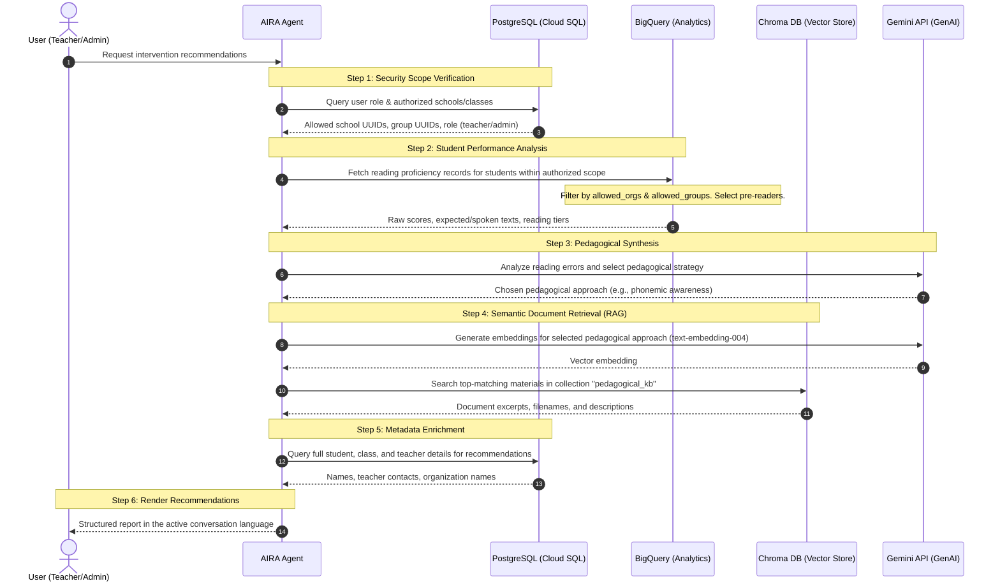

# Pedagogical Recommendations Tool - Implementation Plan

This document outlines the architectural design and step-by-step plan for implementing a new personalized recommendations tool for the **AIRA Reading Assistant** (`aira_reading_assistant` agent). 

The tool will allow the agent to identify students in need of intervention, select ideal pedagogical strategies, perform semantic searches (RAG) over indexed educational materials, and recommend personalized guides to teachers and administrators.

---

## 1. Architectural Overview & Data Flow

The tool will execute in the Agent's environment, orchestrating data retrieval from three separate sources under strict access-control scopes.



---

## 2. Relational Database Mapping & Queries (PostgreSQL)

To link students, classes, and teachers correctly, the tool will execute queries on the Cloud SQL database using the `asyncpg` connection pool.

### 2.1 Authorized Boundaries Enforcement
*   **Active Session Scopes**: The tool reads `user_email`, `allowed_organizations`, and `allowed_groups` from `tool_context.state`.
*   **SQL Constraints**:
    *   **Teachers**: Restrict query boundaries to `allowed_organizations` (schools) and `allowed_groups` (classes).
    *   **Administrators**: Unrestricted access.

### 2.2 Student & Teacher Metadata Query
A query will match student analytics identifiers from BigQuery to relational tables (users, groups, organizations, and relationships) to determine teacher assignments and details.

---

## 3. Student Results Analytical Query (BigQuery)

The tool will fetch reading results using the Google Cloud BigQuery client, targeting students flagged at pre-reader levels.

### 3.1 SQL Query
```sql
SELECT 
    school_uuid, school_name, school_city,
    class_uuid, class_name, class_grade,
    student_uuid, student_name,
    user_rating, response_amount_hits, question_amount_words,
    ARRAY_TO_STRING(question_words, ' ') as expected_text,
    ARRAY_TO_STRING(response_words, ' ') as spoken_text
FROM `student_results`
WHERE (user_rating IN ('Pré-leitor 1', 'Pré-leitor 2', 'Pré-leitor 3', 'Pré-leitor 4') 
       OR response_amount_hits < (question_amount_words * 0.4))
  AND school_uuid IN UNNEST(@allowed_orgs)
  AND class_uuid IN UNNEST(@allowed_groups)
LIMIT 100;
```

---

## 4. Vector Search RAG (Chroma DB & Gemini)

The tool will run RAG (Retrieval-Augmented Generation) queries to search for materials in the knowledge base.

### 4.1 Embeddings & Chroma Access
*   **Chroma Client**: Connect to the Chroma database located at `../Backend/chroma_data` using `chromadb.PersistentClient`.
*   **Embeddings Generation**: Call the standard `google-genai` SDK to generate vector embeddings using `text-embedding-004`.
*   **Chroma Query**:
    ```python
    import chromadb
    from google.genai import Client

    # Generate query embedding
    client = Client()
    emb_res = client.models.embed_content(
        model="text-embedding-004",
        contents=pedagogical_approach
    )
    query_vector = emb_res.embeddings[0].values

    # Query Chroma
    chroma_client = chromadb.PersistentClient(path="../Backend/chroma_data")
    collection = chroma_client.get_collection("pedagogical_kb")
    results = collection.query(
        query_embeddings=[query_vector],
        n_results=3
    )
    ```

---

## 5. Tool Interface Definition

The new tool will be defined in `src/Agent/tools/pedagogical_recommendations.py`.

```python
async def query_pedagogical_recommendations(
    class_name: Optional[str] = None,
    school_name: Optional[str] = None,
    student_uuid: Optional[str] = None,
    tool_context: Optional[ToolContext] = None
) -> dict:
    """Retrieves students in need of intervention, matches them with pedagogical strategies, 
    and searches the knowledge base for matching materials (RAG).

    Args:
        class_name: Optional name of the class to filter.
        school_name: Optional name of the school to filter.
        student_uuid: Optional UUID of a specific student to query.

    Returns:
        A dictionary containing identified students, reading gaps, chosen pedagogical 
        strategies, and lists of recommended files from the knowledge base.
    """
```

### 5.1 System Instructions Update (`src/Agent/agent.py`)
Add instructions explaining when and how the agent should call the tool:
- Triggers when users ask: *"Como posso ajudar os alunos que estão com dificuldades?"*, *"Me dê recomendações de materiais para a turma 2º Ano A"*, or *"Quais intervenções são recomendadas para o aluno X?"*.
- The agent must first run the tool to fetch student metrics and materials, and then summarize the recommendations in a friendly pedagogical format using the active conversation language.

---

## 6. Testing & Regression Prevention Plan

### 6.1 Unit & Integration Tests (`src/Agent/tests/`)
Since the agent code has no unit tests, we will create a tests directory under `src/Agent/tests/` and implement:
1.  **Mock Fixtures** (`src/Agent/tests/conftest.py`):
    *   Setup test sqlite sessions and mock BigQuery / Chroma connections.
2.  **Access Scope Boundaries Verification**:
    *   Verify that if a teacher session is loaded, the tool throws a security error or filters results strictly to their class/organization UUIDs.
    *   Verify that admins can query any class/organization.
3.  **RAG Flow Verification**:
    *   Mock Chroma vector searches and verify that materials are retrieved correctly.
4.  **End-to-End Test Suite Execution**:
    *   Run all tests using pytest.

---

## 7. Implementation Schedule

1.  **Phase 1: Dependencies Setup**: Lock and verify `chromadb` (done).
2.  **Phase 2: Tool Implementation**: Create `src/Agent/tools/pedagogical_recommendations.py` to run SQL, BigQuery, and Chroma queries.
3.  **Phase 3: Agent Configuration**: Attach tool to `root_agent` and update `INSTRUCTIONS` in `src/Agent/agent.py`.
4.  **Phase 4: Writing Tests**: Create `src/Agent/tests/` structure, mock resources, and build pytest test cases.
5.  **Phase 5: Run & Validate**: Launch playground tests and execute `pytest` to guarantee zero regressions.
